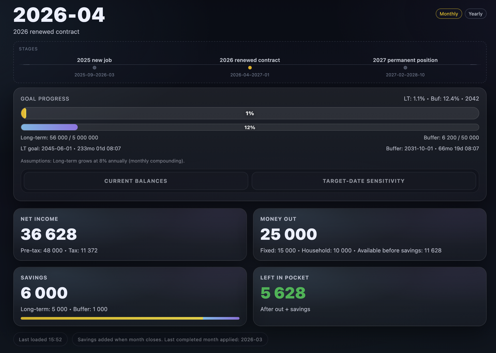

# Luke Finance Dashboard

## Preview



## Data format (plan.json)

The dashboard reads `public/plan.json` at runtime. This is the source of income, savings, and goal data.

### Goals

- `buffer`: Short-term safety cash for unexpected costs or monthly volatility.
- `longterm`: Longer-horizon savings that are modeled with growth.

Long-term projections assume 8% annual growth, compounded monthly, and only apply to the long-term balance.

### Stages

Stages represent time ranges where your income/savings assumptions are stable (often a salary year or a job change). Create a new stage when a major event changes your numbers, like a new job or new recurring costs.

Each stage includes:
- `name`: Short label for the period.
- `from`: Start month in `YYYY-MM`.
- `to`: Optional end month in `YYYY-MM` (leave out for open-ended).

### Example plan.json

```json
{
  "goal": {
    "target_longterm": 1200000,
    "target_buffer": 60000,
    "target_year": 2030,
    "current_longterm": 220000,
    "current_buffer": 20000
  },
  "stages": [
    {
      "name": "New role",
      "from": "2025-01",
      "to": "2025-12",
      "income": 60000,
      "net_income": 42000,
      "fixed_costs": 18000,
      "household": 6000,
      "saving_longterm": 9000,
      "saving_buffer": 1500
    },
    {
      "name": "Promotion",
      "from": "2026-01",
      "income": 68000,
      "net_income": 47000,
      "fixed_costs": 19000,
      "household": 6500,
      "saving_longterm": 11000,
      "saving_buffer": 2000
    }
  ]
}
```

## Run locally

```bash
npm install
npm run start
```

Then open http://127.0.0.1:4173/ in your browser.

## Troubleshooting

- If the page shows "Error loading plan", confirm `public/plan.json` exists and that you opened `http://127.0.0.1:4173/`.
- If the error panel lists validation issues, check that `plan.json` includes a non-empty `stages` array and each stage has `name` and `from` in `YYYY-MM`.
- If you see "State not saved (server offline)", the app is running in-memory; restart `npm run start` and reload.
- If changes are not appearing, hard refresh the browser or disable cache in devtools.
